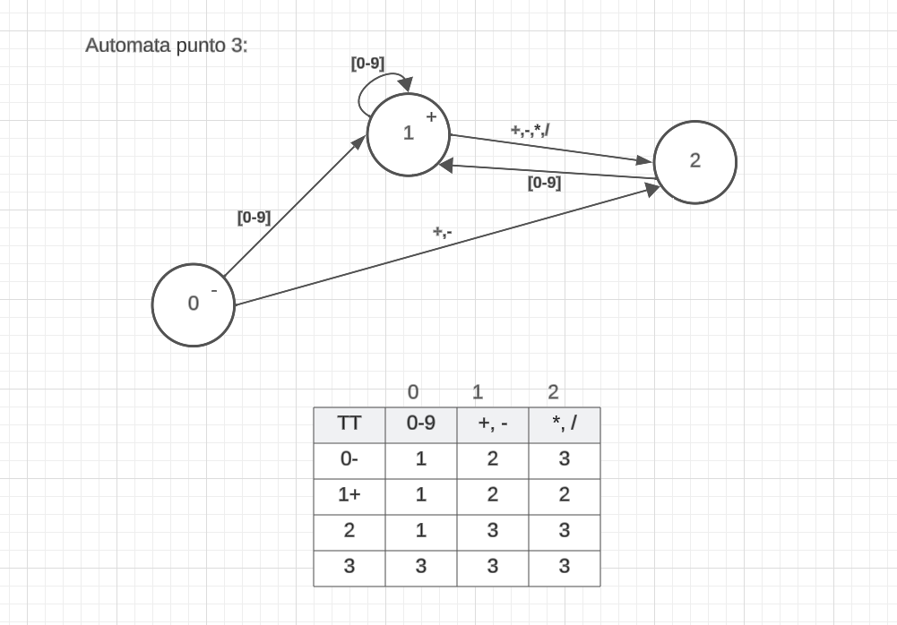

### TP Sintaxis y Semanticas de los Lenguajes

#### Estructura del proyecto ⚙️

```
.
├── README.md
|-- imgs -> Recursos didácticos para la documentación
├── libs
│   ├── automata.c -> Funcionalidades dedicadas a la manipulacion de automatas
│   ├── interface.c -> Funcionalidades dedicadas a la interfaz de usuario
│   ├── utils.c -> Funcionalidades varias
|──main.c
```

### Inicializar el proyecto 📦

#### Consideraciones

- En caso de correr a traves de un archivo este debe ser creado en la carpeta root con el nombre **expresionAritmetica.txt**
- Los automatas desarrollados consumen toda la cadena y al final se determina si terminaron en un estado de rechazo

### Documentación 📖

### Decisiones acerca del punto 1

<p align="center">
  <a >
    
  </a>
</p>

- Se decidio utilizar un unico automata para la detección de tokens. En un principio se consideraron 3 automatas (uno para cada sistema) y luego se decidio unificarlos en uno solo. Al momento de la implementacion se considero mucho más simplificado el automata unificado y de hecho para el codigo termino siendo mucho mas corto.
- En la creación del automata no se tuvo en cuenta el caracter "$" ya que si bien la consigna lo pide, se decidio realizar la separacion entre caracteres desde el codigo y no desde el automata. No se espera que las cadenas sean demasiado largas para encontrar un beneficio en comprobar caracter a caracter si ya cayó en un estado de error

```c
    while (c != '\0')
    {
        if (c != '$') //Se considera el signo $ como un caracter  de separación
        {
            estado = tt[estado][columnaNumeros(c)];
        }
        else
        {
            incrementarContadoresSegunEl(estado, &decimales, &octales, &hexadecimales, &noReconocidos);
            estado = 0;
        }
        c = cadena[++i];
    }
```

### Decisiones acerca del punto 3

<p align="center">
  <a >
    
  </a>
</p>

- Para resolver el desafio de `resolverOperacion` se utilizo la siguiente metodologia:

  1. Se separa la cadena de toda la operación en 2 arrays. Uno de operandos y otro de operadores. Sino comienza con signo, se le agrega un + a los operadores

  ```c
    char operadores[50];
    int operandos[50];
    int i = 0, j = 0, k = 0;
    char enteroCadena[12];
    int terminos[50];

    // La funcion devuelve 1 si es + o -. Por ejemplo la cadena +3-4 devuelve 1 pero 3-4 devuelve 0 pues comienza con un numero
    if (esSumaOResta(expresionAritmetica[0])) // para que comience siempre con un signo
    {
        operadores[0] = expresionAritmetica[0];
        i++; // el siguiente bucle va a comenzar en la posición 1 del array
    }
    else
    {
        operadores[0] = '+';
    }
  ```

  2. Luego se procede a cargar los operandos en el array de operandos y los operadores en el array de operadores.

  ```c
    for (; expresionAritmetica[i]; i++) // cargar operadores y operandos
    {
        if (isdigit(expresionAritmetica[i]))
        {
            enteroCadena[j++] = expresionAritmetica[i];
        }
        else
        {
            enteroCadena[j] = '\0';
            j = 0;
            operandos[k++] = cadenaADecimal(enteroCadena);

            operadores[k] = expresionAritmetica[i];
        }
    }
    enteroCadena[j] = '\0';
    operandos[k] = cadenaADecimal(enteroCadena);

    const int longitud = k;


  ```

  3. Se cargan los terminos operando los y /, con ayuda de la variable primerOperando para guardar el resultado parcial de ir aplicando o/, los + y - sirven para saber donde finaliza un termino y guardar el resultado del termino en el array terminos.

  ```c
  // resolver los terminos y cargarlos en el array terminos
    int primerOperando = operandos[0];
    j = 0;
    for (i = 1; i <= longitud; i++)
    {
        if (esSumaOResta(operadores[i]))
        {
            terminos[j++] = primerOperando;
            primerOperando = operandos[i];
        }
        else
        {
            primerOperando = calcular(primerOperando, operandos[i], operadores[i]);
        }
    }
    terminos[j] = primerOperando;
  ```

  4.Para calcular el resultado final, arranca en 0 y va restando o sumando los terminos segun el operador que le corresponda. Se utiliza la funcion `calcular` para realizar las operaciones.

  ```c
     // operar los terminos
        int resultado = 0;
        j = 0;
        for (i = 0; i <= longitud; i++)
        {
            if (esSumaOResta(operadores[i]))
            {
                resultado = calcular(resultado, terminos[j++], operadores[i]);
            }
        }
  ```
